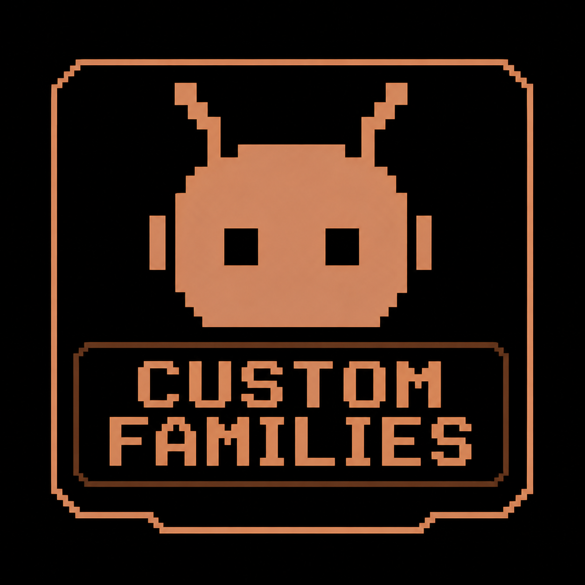

<div align="center">
  

  # Custom Families

  Framework TouchDesigner per organizzare e gestire famiglie di operatori
  personalizzate, con installazione automatica, dialog di conferma,
  watcher di cleanup e UI integrata nella toolbar.
</div>

---

## Panoramica

Custom Families è un sistema di plugin per TouchDesigner che vive sotto
`/ui/Plugins/Custom_families` e fornisce due componenti principali:

- **Custom_families** — il *host* (manager). Installa una toolbar verticale
  in `pane1`, ospita i contenitori `Local` e `Server` per le famiglie,
  espone dialog di install/uninstall e un watcher esterno che pulisce gli
  inject UI quando il host viene rimosso.
- **Custom_fam** — il *template di famiglia*. Componente custom auto-installante
  con il proprio watcher, bottone in toolbar, menu pop-up contestuale,
  operatori custom incorporati e flussi di rename/duplicate/delete.

Drag-and-drop di una famiglia in `/project1` la sposta automaticamente
in `Local`, dove il host la accoglie e installa la sua UI.

---

<details>
<summary><b>Custom_families (toolbar / host) — Documentazione</b></summary>

### Installazione

Quando il COMP `Custom_families` viene posto in `/project1`, il dialog
`Install_window` si apre da solo (gate manuale: l'utente conferma con il
pulsante *Install*). Su conferma, parte una catena di **18 step deferred**
(uno per frame) tracciati dal `Loadbar` interno al dialog:

1. Disable runtime
2. Normalize panes
3. Initialize toolbar (split top/bottom + change pane type + collapse height,
   accorpati nello stesso frame per evitare flicker)
4. Style toolbar (bg color, alpha, opzionale outline su `pane1`)
5. Install watcher (esterno, in `/ui/Plugins/Watcher_Custom_families`)
6. Hide panebar children
7. Install Local bar — 8. Wire Local bar
9. Install Server bar — 10. Wire Server bar
11. Install toolbar button — 12. Wire toolbar button
13. Install Pages — 14. Wire Pages
15. Install Page_number — 16. Set menu label width — 17. Wire Page_number
18. Enable runtime — *(fine)* Enable Local

Lo stato di install viene memorizzato come storage flag `cf_install_complete`
(non più come parametro, eliminata ogni dipendenza da `par.Installstate`).

### Smart "already installed" check

Al pulse di `par.Install` su un host già piazzato, il framework non si fida
del flag: scansiona l'**inventario di 6 inject** (`Watcher`, `Local_bar`,
`Server_bar`, `Custom_families_button`, `Pages`, `Page_number`) e:

- tutti presenti → messaggio "already installed" e exit
- tutti mancanti → reinstall completo silenzioso
- alcuni mancanti → messagebox con la lista di componenti reinstallati e
  reinstall *surgicale* solo dei mancanti

### Disinstallazione

Triggerabile da:
- pulsante toolbar (popMenu su `Custom_families_button` → "Uninstall") che
  apre `Uninstall_window`
- parametro `par.Uninstall` del COMP host (chopexec1 interno)

`Uninstall.Run()` è **family-aware** — chain di 21 step deferred:

1. Restore panebar visibility
2. Restore toolbar styling (reverse di `_set_toolbar_styling`)
3. Restore family panel + families outputs
4. Destroy `Custom_families/Local` *(qui i watcher familiari schedulano
   ognuno la propria pulizia di menu_op)*
5. Destroy `Custom_families/Server`
6. Buffer per i deferred dei watcher familiari
7. Destroy panebar residues (Local_bar, Server_bar, button, Pages, Page_number)
8. Close top pane
9. Destroy Custom_families root

L'ordine `Local/Server destroyed first → toolbars destroyed last` garantisce
che ogni famiglia faccia in tempo a cleanare i suoi inject menu_op
(`insert_*`, `panel_execute_*`, `inject_*`) prima che il watcher in Local_bar
venga distrutto.

### Architettura

```
/ui/Plugins/
├── Custom_families/        ← host
│   ├── Installer/          (Install class + chopexec)
│   ├── Uninstaller/        (Uninstall class + chopexec)
│   ├── Updater/
│   ├── Local/              (famiglie installate dall'utente)
│   ├── Server/             (famiglie remote)
│   ├── Runtime/
│   ├── Dialogs/
│   │   ├── Install_window/
│   │   └── Uninstall_window/
│   └── Ui_inject/          (template inject)
└── Watcher_Custom_families/   ← watcher esterno (Cleanup.py)
```

</details>

---

<details>
<summary><b>Custom_fam (family) — Documentazione</b></summary>

### Cos'è una famiglia

Una *famiglia* è un componente template che si auto-installa sotto
`Custom_families/Local` (o `Server`) e contribuisce alla toolbar globale
con un proprio bottone, un menu contestuale, un set di custom operators
e un watcher di cleanup dedicato.

### Auto-install

Ogni famiglia contiene `Settings/Auto_install_execute` che, su `onCreate` /
`onStart`, chiama `InstallerEXT.HandleInstallValue(1)`. Questo:

- se la famiglia non è dentro `Custom_families/Local` la *sposta* lì
  (oppure pulsa l'install del host se `Custom_families` non esiste ancora,
  attivando il flusso "embedded → /ui/Plugins")
- una volta in posizione, esegue l'install della propria UI: copia il
  bottone in `Local_bar` (o `Server_bar`), inietta `insert_<name>` e
  `panel_execute_<name>` in `/ui/dialogs/menu_op`, inietta
  `inject_<name>` in `/ui/dialogs/menu_op/nodetable`, copia il watcher
  `watcher_<name>` accanto al bottone

### Watcher familiare

Il watcher (`watcher_<FamilyName>` in `Local_bar`) è un OP Execute DAT
che monitora il COMP famiglia. Quando la famiglia viene distrutta:

- registra (sync) i path dei suoi inject menu_op
- schedula un `run(..., delayFrames=2)` che li distrugge in un contesto
  detached (sopravvive anche se il watcher stesso muore, perché la queue
  globale di `run()` è indipendente dall'op che la schedula)
- esclude il watcher e i suoi discendenti dalla lista di destroy per
  evitare auto-distruzione mid-callstack

### Operazioni famiglia

Disponibili dal popMenu del bottone toolbar (vedi sezione successiva):
rename, duplicate, change color, edit custom operators, go to family,
update, export family, release notes, delete.

</details>

---

<details>
<summary><b>Funzionalità del bottone toolbar (popMenu)</b></summary>

Right-click sul bottone della famiglia in `Local_bar` apre un popMenu
contestuale. Voci disponibili:

| Voce | Cosa fa |
|---|---|
| **Go to family** | Naviga il pane bottom dentro il COMP famiglia. Se non c'è un network editor pane, lo splitta. |
| **Rename** | Entra in modalità testo sul label del bottone. Submit rinomina il COMP, l'opshortcut, il watcher, il bottone, e tutti gli inject (`insert_*`, `panel_execute_*`, `inject_*`) per allinearsi al nuovo nome. |
| **Change color** | Apre il color picker. La modifica scrive su `family.par.Colorr/g/b`, e un parexec sincronizza il bottone in toolbar via `_sync_button_color`. |
| **Duplicate** | Copia la famiglia (TD copy nativo). La copia ottiene un nome unico e gestisce la propria install chain via watcher. |
| **Edit custom operators** | Splitta il pane attivo a destra e naviga il nuovo pane in `Custom_operators` della famiglia. |
| **Export family** | Esporta la famiglia come `.tox` per condividerla. |
| **Release notes** | Apre la finestra di visualizzazione delle release notes della famiglia. |
| **Edit release notes** | Apre l'editor delle release notes (per chi sviluppa la famiglia). |
| **View release notes** | Versione read-only delle release notes. |
| **Update** | Trigger di update via `Updater/Update.py` (sostituisce/aggiorna il template). |
| **Delete** | Distrugge il COMP famiglia. Il watcher in `Local_bar` cattura la destroy, schedula la pulizia degli inject menu_op (Level 3 cleanup) e si autodistrugge. Combinato con `Delete_op_execute` del COMP (Level 1 brute-force destroy del bottone) e `UninstallerEXT.RemoveFamily` (Level 2 full UI cleanup). |

### Funzionalità extra del bottone

- **Click sinistro**: toggle del parametro `Selected` della famiglia (la
  famiglia diventa quella attivamente selezionata in toolbar).
- **Drag su pane network**: place automatico di un'istanza degli operatori
  custom della famiglia (gestito da `fam_create_callback.py`).
- **Sys-drop di un .tox di famiglia**: il drop su `/sys/drop` viene
  intercettato e la famiglia viene routata su `Custom_families/Local`
  invece che restare in `/project1`.

</details>

---

## Struttura del repo

```
Main/
├── Custom_families/    sorgenti del host (toolbar manager)
├── Custom_fam/         template di famiglia
├── .tox/               salvataggi TouchDesigner
└── README.md
```

Le cartelle `*_versions/` (snapshot storici) e `Backup/` sono escluse dal
repo via `.gitignore` — sono backup locali, non parte del progetto.

---

## Licenza

[MIT](LICENSE) © 2026 Gianluca Colia
